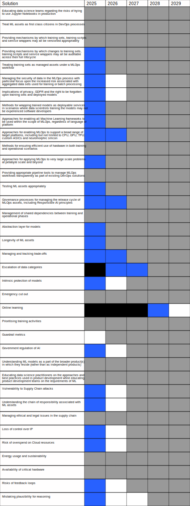

<!-- cSpell:locale en-GB -->

# MLOps Roadmap 2024 - DRAFT

## About this document

This document sets out the current state of MLOps and provides a five year roadmap for future customer needs which is intended to support pre-competitive collaboration across the industry with a view to improving the overall state of MLOps as a capability for all.

It is intended that this document be iteratively refined by group consensus within the MLOps SIG across a series of regular meetings and then published annually whilst relevant.

 

**Acknowledgements**

Current active contributors to the MLOps SIG Roadmap: 

Terry Cox, Cognitional <terry@cognitional.ltd>

Michael Neale, CloudBees <michael.neale@gmail.com>

Kara de la Marck, CDF <karadelamarck@gmail.com>

Ian Hellström, D2IQ

Almog Baku, Rimoto <almog.baku@gmail.com>

Eric Peter <eric@ericpeter.me>

Kim Scofield, Space42 <kscofield@space42.ca>

<!--Amend list of contributors here-->

*DRAFT VERSION*

 

# Introduction

## Current State of MLOps

<!--NOTES: Overview of the current state of MLOps for this year - revised annually. Define principles and methodologies.-->

### What is MLOps?

MLOps could be narrowly defined as "the ability to apply DevOps principles to Machine Learning applications" however as we shall see shortly, this narrow definition misses the true value of MLOps to the customer. Instead, we define MLOps as “the extension of the DevOps methodology to include Machine Learning and Data Science assets as part of a Continuous Delivery process”.

MLOps should be viewed as a practice for consistently managing the ML aspects of products in a way that is unified with all of the other technical and non-technical elements necessary to successfully commercialise those products with maximum potential for viability in the marketplace. This includes DataOps, too, as machine learning without complete, consistent, semantically valid, correct, timely, and unbiased data is problematic or leads to flawed solutions that can exacerbate built-in biases.

> MLOps is not to be confused with "AIOps". AIOps often means an application of AI technologies to Ops data with sometimes unclear aims for gaining insights. These terms are still evolving, but for the purposes of this document we do not mean AIOps in the latter usage. Some organisations are more comfortable with the designation 'AI' rather than 'Machine Learning' and so it is to be expected that MLOps may be referred to by AIOps in those domains, however the reverse is not true as use of the term 'AIOps' may not refer to the MLOps methodology.

### What is MLOps not?

It sometimes helps to consider what anti-patterns exist around a concept in order to better understand it.

For example, MLOps is not "putting Jupyter Notebooks into production environments".

RAD tools like Jupyter Notebooks can be extremely useful, both in classroom environments and in exploring problem spaces to understand potential approaches to mathematical problems. However, like all Rapid Application Development tools, they achieve the rapid element of their name by trading off other key non-functional requirements like maintainability, testability and scalability.

In the next section, we will discuss the key drivers and constraints for MLOps and expand upon the requirements for a true Continuous Delivery approach to managing ML assets. At this point in the development of the practice, it perhaps helps to understand that much of ML and AI research and development activity has been driven by Data Science rather than Computer Science teams. This specialisation has enabled great leaps in the ML field but at the same time means that a significant proportion of ML practitioners have never been exposed to the lessons of the past seventy years of managing software assets in commercial environments.

As we shall see, this can result in large conceptual gaps between what is involved in creating a viable proof of concept of a trained ML model on a Data Scientist’s laptop vs what it subsequently takes to be able to safely transition that asset into a commercial product in production environments. MLOps in practice is still on the early path towards maturity and it is likely that many practices that are commonly seen today, will be abandoned for better approaches over the next few years as teams get more exposure to the full scope of this problem domain.

## Drivers

<!--NOTES: Driving forces for the current snapshot of the roadmap.-->

### General DevOps drivers applied to MLOps

* Optimising the process of taking ML features into production by reducing Lead Time

* Optimising the feedback loop between production and development for ML assets

* Supporting the problem-solving cycle of experimentation and feedback for ML applications

* Unifying the release cycle for ML and conventional assets

* Enabling automated testing of ML assets

* Application of Agile principles to ML projects

* Supporting ML assets as first class citizens within CI/CD systems

* Enabling shift-left on Security to include ML assets

* Improving quality through standardisation across conventional and ML assets

* Applying Static Analysis, Dynamic Analysis, Dependency Scanning and Integrity Checking to ML assets

* Reducing Mean Time To Restore for ML applications

* Reducing Change Fail Percentage for ML applications

* Management of technical debt across ML assets

* Enabling whole-of-life cost savings at a product level

* Reducing overheads of IT management through economies of scale

* Facilitating the re-use of ML approaches through template or ‘quickstart’ projects

* Managing risk by aligning ML deliveries to appropriate governance processes

* SBOMs, asset signing, chain-of-custody

### Drivers unique to Machine Learning solutions that represent MLOps requirements

* Mitigating the risks associated with producing decision-making products

* Provide specific testing support for detecting ML-specific errors

* Verifying that algorithms make decisions aligned to customer values

* Tracking long-term stability of ML asset performance

* Incorporate ethical governance into management of ML assets

* Enabling automated bias detection testing

* Ensuring explainability of decisions

* Ensuring fairness in decisions

* Providing transparency and audit-ability of ML assets

* Allowing for provability of decision-making algorithms

* Ensuring long term supportability of long-lived ML assets

* Manage ML-specific security risks such as adversarial attacks

* Providing clear action paths to suspend or revert failed ML assets in production environments

* Managing economic risks associated with deployment of key decision-making systems on customer infrastructure

* Leveraging ML techniques to improve MLOps solutions

* Mitigating liability risk and accountability through appropriate due-diligence over ML assets

* Facilitating compliance verification against regional AI legislation

* Enabling fast development life cycles by offering out-of-the-box (correlated) sampling of relevant data sets

* Enabling online (streaming) and offline (batch) model predictions

* Accelerating enterprise-wide development of models through ready-to-reuse features (i.e. feature stores)

 

## Constraints

<!-- NOTES: Constraints evolving as society adapts to Machine Learning in everyday use. -->

### Machine Learning solutions as decision-making systems:

Machine Learning solutions tend to be decision-making systems, rather than just data processing systems, and thus are increasingly required to be held accountable to much higher standards than those applied to the best quality software delivery projects. The bar for quality and governance processes is therefore very high, in many cases representing legal compliance processes mandated by legislation spanning various levels of governmental and intergovernmental entities. 

In addition, this is a space of rapidly changing legal compliance; therefore, in order to maintain deployment frequency and lead-time metrics, it will be necessary for MLOps to develop in a manner that facilitates automation of governance processes within release processes. 
 

### Current and future governance and legal risks associated with producing decision-making systems:

As MLOps decision-making solutions increasingly displace human decision-makers in commerce and government, we encounter a new class of governance problems, collectively known as ‘Responsible AI’. These governance problems introduce a range of challenges around complex issues such as ethics, fairness and bias in ML models. They often fall under government regulation that requires interpretability and explainability of models, often to a standard higher than that applied to human staff. 

It is therefore necessary for MLOps to develop in a manner that:

* Facilitates Responsible AI governance in areas such as ethics, fairness and bias.

* Facilitates existing and future complex governance processes mandated by legislation that potentially spans multiple levels of government, including intergovernmental entities.

### Current and future governance and legal risks associated with security and data privacy:

Legal compliance processes exist at various levels of government and intergovernmental oversight. These processes may include ethics, fairness, bias, data privacy, and security. It is therefore necessary for MLOps to develop in a manner that:

* Facilitates both existing and expected future requirements of oversight, transparency audits, privacy, and security.

* Facilitates the complex array of both existing governance processes and potential future governance processes. This may require high level, complex, interpretability and explainability of models.

 

## Vision

<!--NOTES: Narrative vision for the future of MLOps.-->

An optimal MLOps experience is one where Machine Learning assets are treated consistently with all other software assets within a CI/CD environment. Machine Learning models can be deployed alongside the services that wrap them and the services that consume them as part of a unified release process.

MLOps must be language-agnostic. Training scripts for ML models can be written in a wide range of different programming languages, so a focus on Python is artificially limiting to widespread adoption.

MLOps must be framework-agnostic. There are a plethora of different Machine Learning frameworks commonly in use today and it is to be expected that these will continue to proliferate over time. It must be possible to use any desired framework within an MLOps context and be possible to combine multiple frameworks in any given deployment.

MLOps must be platform and infrastructure agnostic. Adoption of MLOps is predicated upon being able to operate using this approach within the constraints of previously defined corporate infrastructure. It should be presumed unlikely that MLOps alone is a sufficient driver to motivate fundamental change to infrastructure.

It is very important that MLOps should make no over-simplified assumptions with respect to hardware. To achieve currently known customer requirements in a range of ML fields, it will be necessary to achieve performance gains of at least three orders of magnitude. This can be expected to lead to significant change with respect to the hardware utilised to train and execute models.

We make the following assertions:

- Models may expect to be **trained** on various combinations CPU, GPU, TPU, dedicated ASICs or custom neuro-morphic silicon, with new hardware entering the market regularly.
- Models may expect to be **executed** on various combinations CPU, GPU, TPU, dedicated ASICs or custom neuro-morphic silicon, again with new hardware entering the market regularly.
- It **must not** be assumed that models will be executed on the same hardware as they are trained upon.

It is desirable to have the ability to train once but run anywhere, that is, models are trained on specific hardware to minimise training time, and optimised for different target devices based on cost or performance considerations, however this aspiration may need to be tempered with a degree of pragmatism. The ability to train on a given hardware platform requires, at minimum, dedicated driver support, and in practice usually also necessitates extensive library / framework support. The ability to execute on a given hardware platform may involve having to significantly optimise resource usage to lower product cost or require the production of dedicated silicon specific to a single task.

 Whilst there will undoubtedly be common scenarios, for example in Cloud deployment, where CPU -> CPU or GPU -> GPU is sufficient to meet requirements, MLOps must allow for a broad range of potential cross-compilation scenarios. 

MLOps implementations should follow a ‘convention over configuration’ pattern, seeking to minimise the level of build-specific assets that need to be maintained on top of the desired solution. Where configuration is necessary, it should be synthesised where possible and operate on the principle of always creating working examples that can be modified incrementally by customers to meet their needs.

The use of MLOps should teach best known methods of applying MLOps. It should be recognised that many customers will be experts in the field of Data Science but may have had relatively little exposure to DevOps or other SDLC principles. To minimise the learning curve, MLOps defaults should always align to best practice in production environments rather than ‘quick-and-dirty’ as might be the case for expert users wishing to trial an instance of the tooling in a test bench environment.

 

# Scope

The focus of this roadmap is upon aspects relating to extending DevOps principles to the area of Machine Learning and does not discuss basic features of DevOps or CI/CD approaches that are common across both domains. The intention is for MLOps to decorate DevOps rather than differentiate.

 

# Summary and Updates

<!--NOTES: Executive summary of the roadmap and what’s new in revised versions.-->

This is the fourth edition of the MLOps Roadmap and this year the adoption of ML and AI solutions has become ubiquitous across the majority of industries. The fear of missing out has led to 'AI' becoming a cure-all marketing phrase being applied to pocket warmers and bottled water, placing the subject at the peak of inflated expectations and on the slippery slope towards the trough of disillusionment.

Demand for compute resources for ML training has now outstripped supply, with leading edge devices now selling out a year in advance of production capacity. Performance is improving slightly ahead of predictions with current systems reaching 90 TFlops (FP64) with memory bandwidth around 16 TB/s. A benchmark point of reference is 50,000 compute nodes of around 11 TFlops/node to simulate a realtime cerebellum.

Performance of real world systems in this space remain limited by network and memory bandwidth, so the careful decomposition of workloads into optimised deployments aligned to target hardware constraints is significant to overall training cycle time. Greater gains can be realised by improving the efficiency of tooling to distribute pipeline workloads more effectively, compared to the expected growth rate in raw compute performance.

We are entering a 'cambrian explosion' period of extreme diversity in new application devices, so it is very important that we set aside habitual biases about considering the target of any product deployment as a conventional server or Cloud environment. The target of an ML asset is now much more likely to be a very specialised architecture, in a vehicle, a personal augmentation device or as part of a distributed mesh of edge compute devices. 'Train in the Cloud, deploy in the World' is going to be the challenge facing us over the next few years.

Many businesses are now committed to the transition from Decision-Support Systems to Decision-Making Systems. This increasingly puts the quality of the organisation's Continuous Delivery processes at the core of maintaining the reputation and the operational effectiveness of these organisations in the future. An integrated MLOps process is now critical to survival over the next few years.

The Continuous Delivery Foundation continues to publish a best practices guide to implementing Continuous Delivery, which takes into consideration the challenges raised in this document as part of a practical approach to the problem space. See [https://bestpractices.cd.foundation](https://bestpractices.cd.foundation)

What is new for this edition is the formal adoption of AI regulations across a number of jurisdictions with many now in force in transitional form, such as those in the EU, and others passing into law in the coming year. This will negatively impact a large number of products which currently lack appropriate governance processes, and which may be forced to withdraw from these markets as a result.

 

# Challenges

In this section, we identify challenges in the near and far term that constrain the customer from successfully adopting and benefiting from MLOps principles:

<table>
  <tr>
    <td>Educating data science teams regarding the risks of trying to use Jupyter Notebooks in production</td>
    <td>- Communicating the SDLC and the lessons of DevOps in a way that is comfortable for the audience 
- Highlighting the dangers of using RAD tools in production 
- Demonstrate simple alternatives that are easy to use as part of an MLOps process</td>
  </tr>
  <tr>
    <td>Treat ML assets as first class citizens in DevOps processes</td>
    <td>- Extend CI/CD tools to support ML assets 
- Integrate ML assets with version control systems </td>
  </tr>
  <tr>
    <td>Providing mechanisms by which training/testing/validation data sets, training scripts, models, experiments, and service wrappers may all be versioned appropriately</td>
    <td>- All assets under version control 
- ML assets include sets of data 
- Data volumes may be large 
- Data may be sensitive 
- Data ownership may be complex 
- Multiple platforms may be involved </td>
  </tr>
  <tr>
    <td>Providing mechanisms by which changes to training/testing/validation data sets, training scripts, models, experiments, and service wrappers may all be auditable across their full lifecycle</td>
    <td>- Models may be retrained based upon new training data 
- Models may be retrained based upon new training approaches 
- Models may be self-learning 
- Models may degrade over time 
- Models may be deployed in new applications 
- Models may be subject to attack and require revision 
- Incidents may occur that require root cause analysis and change 
- Corporate or government compliance may require audit or investigation </td>
  </tr>
  <tr>
    <td>Treating training/testing/validation data sets as managed assets under a MLOps workflow</td>
    <td>- Content of training/testing/validation data sets is essential to audit process, root cause analysis 
- Data is not typically treated as a managed asset under conventional CI/CD 
- Data may reside across multiple systems 
- Data may only be able to reside in restricted jurisdictions 
- Data storage may not be immutable 
- Data ownership may be a factor </td>
  </tr>
  <tr>
    <td>Managing the security of data in the MLOps process with particular focus upon the increased risk associated with aggregated data sets used for training or batch processing</td>
    <td>- Aggregated data carries additional risk and represents a higher value target 
- Migration of data into Cloud environments, particularly for training, may be problematic</td>
  </tr>
  <tr>
    <td>Implications of privacy, GDPR and the right to be forgotten upon training sets and deployed models</td>
    <td>- The right to use data for training purposes may require audit 
   - Legal compliance may require removing data from audited training sets, which in turn implies the need to retrain and redeploy models built from that data. 
   -  The right to be forgotten or the right to opt out of certain data tracking may require per-user reset of model predictions</td>
  </tr>
  <tr>
    <td>Methods for wrapping trained models as deployable services in scenarios where data scientists training the models may not be experienced software developers with a background in service-oriented design</td>
    <td>Operational use of a model brings new architectural requirements that may sit outside the domain of expertise of the data scientists who created it.  
Model developers may not be software developers and therefore experience challenges implementing APIs around their models and integrating within solutions. </td>
  </tr>
  <tr>
    <td>Approaches for enabling all Machine Learning frameworks to be used within the scope of MLOps, regardless of language or platform</td>
    <td>Common mistake to assume ML = Python  
Many commonly used frameworks such as PyTorch and TensorFlow exist and can be expected to continue to proliferate.  
MLOps must not be opinionated about frameworks or languages. </td>
  </tr>
  <tr>
    <td>Approaches for enabling MLOps to support a broad range of target platforms, including but not limited to CPU, GPU, TPU, custom ASICs and neuro-morphic silicon.</td>
    <td>Choice of training platform and operational platform may be varied and could be different for separate models in a single project</td>
  </tr>
  <tr>
    <td>Methods for ensuring efficient use of hardware in both training and operational scenarios</td>
    <td>- Hardware accelerators are expensive and difficult to virtualise 
- Cadence of training activities impacts cost of ownership 
- Elastic scaling of models against demand in operation is challenging when based upon hardware acceleration </td>
  </tr>
  <tr>
    <td>Approaches for applying MLOps to very large scale problems at petabyte scale and beyond</td>
    <td>- Problems associated with moving and refreshing large training sets 
- Problems associated with distributing training loads across hardware accelerators 
- Problems with speed of distributing training data to correct hardware accelerators 
- Problems of provisioning / releasing large pools of hardware resources </td>
  </tr>
  <tr>
    <td>Providing appropriate pipeline tools to manage MLOps workflows transparently as part of existing Continuous Delivery solutions</td>
    <td>- Integration of ML assets with existing CD/CD solutions 
- Extending Cloud-native build tools to support allocation of ML assets, data and hardware during training builds 
- Hardware pool management </td>
  </tr>
  <tr>
    <td>Testing ML assets appropriately</td>
    <td>- Conventional Unit / Integration / BDD / UAT testing 
- Adversarial testing 
- Bias detection 
- Fairness testing 
- Ethics testing 
- Interpretability 
- Stress testing 
- Security testing </td>
  </tr>
  <tr>
    <td>Governance processes for managing the release cycle of MLOps assets, including Responsible AI principles</td>
    <td>- Managing release of new training sets to data science team 
- Establishing thresholds for acceptable models 
- Monitoring model performance (and drift) over time to feed into thresholds for retraining and deployments 
- Managing competitive training of model variants against each other in dev environments 
- Managing release of preferred models into staging environments for integration and UAT 
- Managing release of specific model versions into production environments for specific clients/deployments 
- Managing root cause analysis for incident investigation 
- Observability / interpretability 
- Explainability and compliance</td>
  </tr>
  <tr>
    <td>Management of shared dependencies between training and operational phases</td>
    <td>A number of ML approaches require the ability to have reusable resources that are applied both during training and during the pre-processing of data being passed to operational models. It is necessary to be able to synchronise these assets across the lifecycle of the model. e.g. Preprocessing, Validation, Word embeddings etc.</td>
  </tr>
    <tr>
    <td>Abstraction for models</td>
    <td>Stored models are currently often little more than serialised objects. To decouple training languages, platforms and hardware from operational languages, platforms and hardware it is necessary to have broadly supported standard intermediate storage formats for models that can be used reliably to decouple training and operational phases.</td>
  </tr>
  <tr>
    <td>Longevity of ML assets</td>
    <td>Decision-making systems can be expected to require very long effective operating lifetimes. It will be necessary in some scenarios to be able to refer to instances of models across significant spans of time and therefore forward and backward compatibility issues, storage formats and migration of long running transactions are all to be considered.</td>
  </tr>
  <tr>
    <td>Managing and tracking trade-offs</td>
    <td>Solutions including ML components will be required to manage trade-offs between multiple factors, for example in striking a balance between model accuracy and customer privacy, or explainability and the risk of revealing data about individuals in the data set. It may be necessary to provide intrinsic metrics to help customers balance these equations in production. It should also be anticipated that customers will need to be able to safely A/B test different scenarios to measure their impact upon this balance.</td>
  </tr>
  <tr>
    <td>Escalation of data categories</td>
    <td>As a side effect of applying governance processes to check for fairness and bias within models, it may become necessary to hold special category data providing information about race, religion or belief, sexual orientation, disability, pregnancy, or gender reassignment in order to detect such biases. As a result of this, there will be an escalation of data sensitivity and in the legal constraints that apply to the solution.</td>
  </tr>
  <tr>
    <td>Intrinsic protection of models</td>
    <td>Models are vulnerable to certain common classes of attack, such as: 
    &nbsp &nbsp- Black box attempts to reverse engineer them 
    &nbsp &nbsp- Model Inversion attacks attempting to extract data about individuals 
    &nbsp &nbsp- Membership Inference attacks attempting to verify the presence of individuals in data sets 
    &nbsp &nbsp- Adversarial attacks using tailored data to manipulate outcomes 
    It should be anticipated that there will be a need for generic protections against these classes of challenge across all deployed models.</td>
  </tr>
 
  <tr> 
   <td>Emergency cut out</td>
   <td>As models are trained typically with production/runtime data, and act on production data, there can be cases where undesirable behaviour of a recently deployed model change is only apparent in a production environment. One example is a chat bot that uses inappropriate language in reaction to some interactions and training sets. There is a need to have the ability to quickly cut out a model or roll back immediately to an earlier version should this happen.</td>
 
  </tr>
  
  <tr> 
   <td>Online learning</td>
   <td>There are systems in use that use online learning, where a model or similar evolves in near real time with the data flowing in (and there is not necessarily a deploy stage). Systems also may modify themselves at runtime in this case without any sort of rebuilding or human approval. This will require further research and observation of emerging practices and use cases of this approach to machine learning.</td>
 
  </tr>  
 <tr> 
   <td>Prioritising training activities</td>
   <td>Training activities are time-consuming. In scenarios where systems support the simultaneous queuing and/or processing of multiple training activities, it must be possible to prioritise those activities to prevent long-running trainings from blocking the deployment of other processes such as security or bug fixes.</td>
  </tr>  
 <tr> 
   <td>Guardrail metrics</td>
   <td>MLOps processes always carry inherent risk so systems should support the use of guardrail metrics to aid in mitigating these risks.</td>
  </tr>  
 <tr> 
   <td>Government regulation of AI</td>
   <td>Newly adopted legislation on AI introduces the power to regulate or prohibit certain classes of products.  
    Regulation introduces: 
    &nbsp &nbsp- Prohibition on certain use cases for ML 
    &nbsp &nbsp- Mandatory data quality controls 
    &nbsp &nbsp- Mandatory end-to-end compliance documentation 
    &nbsp &nbsp- Transparency of system decisions 
    &nbsp &nbsp- Human oversight over functioning 
    &nbsp &nbsp- Ongoing publication of accuracy metrics 
    &nbsp &nbsp- Proof of resilience against error or attack  
Compliance requires: 
    &nbsp &nbsp- Third party conformity assessment prior to release 
    &nbsp &nbsp- A new conformity assessment for each change 
    &nbsp &nbsp- Post-market monitoring 
    &nbsp &nbsp- Mandatory incident reporting 
    &nbsp &nbsp- Traceability throughout the system’s lifecycle  
Government agencies, third party accreditation businesses and their subcontractors are required to have access to confidential intellectual property.  Surveillance authorities shall be granted full access to the training, validation and testing datasets used.
</td>
</tr>  
<tr> 
<td>Understanding ML models as a part of the broader product(s) in which they reside (rather than as independent products)</td>
   <td>ML predictions are always exposed within the context of a broader user experience (interface), whether that experience is an application, report, or other UI/UX.    
  This creates a challenge to manage the ML assets of a product in such a way that: 
&nbsp &nbsp- ML assets can be associated with a product so that consistent governance processes can be applied to the product & its ML assets 
&nbsp &nbsp- ML assets can be sold / transferred as a block of IP or re-used in other systems/applications  
  Furthering this challenge is that sometimes multiple ML models are used in a single user-facing feature or a single ML model is used in multiple applications.  
Other challenges address the technical concerns (linking & releasing ML assets in tandem with software assets, etc).</td>
</tr>  
<tr> 
<td>Educating data science practitioners on the approaches & best practices used in product development while educating product development teams on the requirements of ML</td>
   <td>Many best practices and approaches exist for delivering software products (Product/Customer Discovery, Lean Startups, Agile Development, Product Lifecycle Management, DevOps, Shift Left, etc).  These approaches are well-understood and engrained in the culture of most product-led organisations.  
   As ML matures to the point where the vast majority of business challenges can be addressed with “off the shelf” ML approaches, the use of ML will become a de-facto standard part of every software application.  
   Accordingly, data scientists will need to build ML models as a participant in the software development processes where these approaches are applied (rather than as a separate process).  
   The challenge is to educate data scientists on established product processes and to communicate the additional requirements that ML brings to asset management. 
</td>
</tr>
<tr> 
<td>Vulnerability to Supply Chain attacks</td>
<td>ML applications rely upon many third party dependencies in order to operate. Since these are outside of the control of local teams, they introduce the risk that they may be subverted as part of a widespread, or targeted attack on local systems. 
</td>
</tr>
<tr> 
<td>Understanding the chain of responsibility associated with ML assets</td>
<td>Under some regulatory systems, the responsibility for the correctness of any AI component falls legally upon the final deployer, meaning that the last entity in the chain of responsibility carries the brunt of any legal challenges.  
Each third party ML asset adopted by a solution integrator becomes their legal liability in practical terms. 
</td>
</tr>
<tr> 
<td>Managing ethical and legal issues in the supply chain</td>
<td>Some ML-related services are currently sold with the implication that they are automated, but in practice are implemented using teams of people operating in abusive or unfair conditions in violation of labour regulations.  
This can lead to legal ramifications or reputational damage to teams downstream from these services. 
</td>
</tr>
<tr> 
<td>Loss of control over IP</td>
<td>The status of intellectual property created by ML is currently poorly defined. Anything created by a third party model can be replicated by the owner of that model (or any other customer) and claimed as their IP.  
This can result in a situation where generated content produced and distributed by one party can legally be copyright claimed by a third party after the fact and revenue streams redirected. 
</td>
</tr>
<tr> 
<td>Risk of overspend on Cloud resources</td>
<td>ML assets are often trained and operated using on-demand Cloud resources such as GPUs. Poor configuration or implementation can lead to uncontrolled consumption of these resources, leading to very high usage charges. 
</td>
</tr>
<tr> 
<td>Energy usage and sustainability</td>
<td>ML model training and inferencing can be extremely costly in terms of energy consumption. As a rule of thumb, training a billion parameter model currently consumes about one gigawatt of power.  
Energy demand is on a course to outstrip generating capacity in only a decade or so, which implies that caps on consumption must be expected in the near future. 
</td>
</tr>
<tr> 
<td>Availability of critical hardware</td>
<td>The supply of GPU accelerators is currently outstripping supply, which will lead to widespread disruption in the ability to train or operate models. 
</td>
</tr>
<tr> 
<td>Risks of feedback loops</td>
<td>Providing the output of ML models as training data for subsequent models leads to rapid degradation in efficacy. It is important to ensure that this does not occur in an uncontrolled manner, or through unintended consequences of a business application. 
</td>
</tr>
<tr> 
<td>Mistaking plausibility for reasoning</td>
<td>Large model instances can produce experiences that are perceived as real and relevant to users interacting with the model. This greatly magnifies the plausibility of any given result as being accurate due to being well expressed.  
It is critical to keep in mind that current large models are not capable of reasoning on facts presented to them, only to return output that is plausibly associated with such facts. 
</td>
</tr>
</table>

 

# Technology Requirements

In this section, we capture specific technology requirements to enable progress against the challenges identified above:

<table>
  <tr>
    <td>Educating data science teams regarding the risks of trying to use Jupyter Notebooks in production</td>
    <td>Jupyter Notebooks are the tool we use to educate Data Scientists as they can easily be used to explore ad hoc ML problems incrementally on a laptop. Unfortunately, when all you have is a hammer, everything tends to look like a nail.   We see Jupyter Notebooks featuring in production scenarios, not because this are the best tool for the job, but because this is the tool we taught people to use and because we didn't teach about any of the problems inherent in using that tool.   This approach persists because of an ongoing gap in the tool chain.  
- Improved technology solutions are required that enable Data Scientists to easily run experiments at scale on elastic Cloud resources in a consistent, audited and repeatable way. 
- These solutions should integrate with existing Integrated Development Environments, Source Code Control and Quality Management tools. 
- Solutions should integrate with CI/CD environments so as to facilitate Data Scientists setting up multiple variations on a training approach and launching these as parallel, audited activities on Cloud infrastructure. 
- Working with the training of models and the consumption of trained models should be a seamless experience within a single toolchain. 
- Tooling should introduce new Data Scientists to the core concepts of software asset management, quality management and automated testing. 
- Tooling should enable appropriate governance processes around the release of ML assets into team environments. </td>
  </tr>
  <tr>
    <td>Treat ML assets as first class citizens in DevOps processes</td>
    <td>ML assets include but are not limited to training sets, training configurations (hyper-parameters), scripts and models. Some of these assets can be large, some are more like source code assets. We should be able to track changes to all these assets, and see how the changes relate to each other. Reporting on popular DevOps "metrics" like "Change Failure Rate" and "Mean cycle time" should be possible if done correctly. Whilst some of these assets are large, they are not without precedent in the DevOps world. People have been handling changes to database configurations, copying and backup of data for some time, so they same should apply to all ML assets. In the following sections we can explore how this may be implemented.</td>
  </tr>
  <tr>
    <td>Providing mechanisms by which training sets, training scripts and service wrappers may all be versioned appropriately</td>
    <td>Training sets are prepared data sets which are extracted from production data. They may contain PII or sensitive information, so making the data available to developers in a way analogous to source code may be problematic. Training scripts are smaller artefacts but are sometimes coupled to the training sets. All scripts should be versioned in a way that makes the connected to the training sets that they are associated with. Scripts and training sets are also coupled to meta data, such as instructions as to how training sets are split up for testing and validation, so a model can be reproduced in ideally a deterministic manner if required.</td>
  </tr>
  <tr>
    <td>Providing mechanisms by which changes to training sets, training scripts and service wrappers may all be auditable across their full lifecycle</td>
    <td>It is an essential requirement that all changes to ML assets must result in a robust audit trail capable of meeting forensic standards of analysis. It must be possible to work backwards from a given deployment of assets at a specified time, tracing all changes to this set of assets and the originators of each change. Tooling supporting decision-making systems in applications working with sensitive personal data or life-threatening situations must support non-repudiation and immutable audit records.  
    It should be anticipated that customers will be operating in environments subject to legal or regulatory compliance requirements that will vary by industry and jurisdiction that may require varying standards of audit transparency, including requirements for third party audit.</td>
  </tr>
  <tr>
    <td>Treating training sets as managed assets under a MLOps workflow</td>
    <td>One of the difficult challenges for MLOps tooling is to be able to treat data as a managed asset in an MLOps workflow. Typically, it should be expected that traditional source code control techniques are inapplicable to data assets, which may be very large and reside in environments that are not amenable to tracking changes in the same manner as source code. New meta-data techniques must be created to effectively record and manage aggregates of data that represent specific versions of training, testing or validation sets. Given the variety of data storage mechanisms in common usage, this will likely necessitate pluggable extensions to tooling.  
    It must be possible to define a specific set of data which can be introduced into MLOps tooling for a given training run to produce a model version, and to retrospectively inspect the set of data that was used to create a known model version in the past. Multiple model instances may share one data set and subsequent iterations of a model may be required to be regression tested against specific data set instances. It should be recognised that data sets are long-lived assets that may have compliance implications but which may also be required to be edited in response to data protection requests, invalidating all models based upon a set.
    </td>
  </tr>
  <tr>
    <td>Managing the security of data in the MLOps process with particular focus upon the increased risk associated with aggregated data sets used for training or batch processing</td>
    <td>The vast majority of MLOps use-cases can be expected to involve mission-critical applications, sensitive personal data and large aggregated data sets which all represent high value targets with high impact from a security breach. As a result, MLOps tooling must adopt a 'secure-by-design' position rather than assuming that customers will harden their deployments as part of their responsibilities.  
    Solutions must not default to insecure configurations for convenience, nor should they provide user-facing options that invalidate system security as a side effect of adding functionality.</td>
  </tr>
  <tr>
    <td>Implications of privacy, GDPR and the right to be forgotten upon training sets and deployed models</td>
    <td>- Tooling should provide mechanisms for auditing individual permissions to use source data as part of training sets, with the assumption that permission may be withdrawn at any time  
    - Tooling should provide mechanisms to invalidate the status of deployed models where permissions to use have been revoked  
    - Tooling may optionally provide mechanisms to automatically retrain and revalidate models on the basis of revoked permissions  
    - Tooling should facilitate user-specific exceptions to model invocation rules where this is necessary to enable the right to be forgotten or to support the right to opt out of certain types of data tracking
    </td>
  </tr>
  <tr>
    <td>Methods for wrapping trained models as deployable services in scenarios where data scientists training the models may not be experienced software developers with a background in service-oriented design</td>
    <td>Models that have been trained and which have passed acceptance testing need to be deployed as part of a broader application. This might take the form of elastically scalable Cloud services within a distributed web application, or as an embedded code/data bundle within a mobile application or other physical device. In some cases, it may be expected that models need to be translated to an alternate form prior to deployment, perhaps as components of a dedicated FPGA or ASIC in a hardware solution.  
    - MLOps tooling should integrate and simplify the deployment of models into customer applications, according to the architecture specified by the customer.  
    - MLOps tooling should not force a specific style of deployment for models, such as a dedicated, central 'model server'  
    - Tooling should assume that model execution in Cloud environments must be able to scale elastically  
    - Tooling should allow for careful management of execution cost of models in Cloud environments, to mitigate the risk of unexpected proliferation of consumption of expensive compute resources  
    - Tooling should provide mechanisms for out-of-the-box deployment of models against common architectures, with the assumption that customers may not be expert service developers  
    - Tooling should provide automated governance processes to manage the release of models into production environments in a controlled manner  
    - Tooling should provide the facility to upgrade and roll-back deployed models across environments  
    - It should be assumed that models represent reusable assets that may be deployed in the form of multiple instances at differing point release versions across many independent production environments  
    - It should be assumed that more than one point release version of a model may be deployed concurrently in order to support phased upgrades of system functionality across customer environments
    </td>
  </tr>
  <tr>
    <td>Approaches for enabling all Machine Learning frameworks to be used within the scope of MLOps, regardless of language or platform</td>
    <td>MLOps is a methodology that must be applicable in all environments, using any programming language or framework. Implementations of MLOps tooling may be opinionated about the approach to the methodology but must be agnostic to the underlying technologies used to implement the models and services associated.  
    It should be possible to use MLOps tooling to deploy solution components utilising different languages or frameworks using loosely-coupled principles to provide compatibility layers.</td>
  </tr>
  <tr>
    <td>Approaches for enabling MLOps to support a broad range of target platforms, including but not limited to CPU, GPU, TPU, custom ASICs and neuro-morphic silicon.</td>
    <td>MLOps should be considered as a cross-compilation problem where the architectures of the source and target platforms may be different. In trivial cases, models may be trained on say CPU or GPU and deployed to execute on the same CPU or GPU architecture, however other scenarios already exist and should be expected to be increasingly likely in the future. This may include training on GPU / TPU and executing on CPU or, in edge devices, training on any architecture and then translating the models into physical logic that can be implemented at very low cost / size / power directly on FPGA or ASIC devices.  
    This implies the need for architecture-independent intermediate formats to facilitate cross-deployment or cross-compilation onto target platforms.</td>
  </tr>
  <tr>
    <td>Methods for ensuring efficient use of hardware in both training and operational scenarios</td>
    <td>ML training and inferencing operations are typically very processing intensive operations that can expect to be accelerated by the use of dedicated hardware. Training is essentially an intermittent ad-hoc process that may run for hours-to-days to complete a single training run, demanding full utilisation of large scale compute resources for this period and then releasing that demand outside active training runs. Similarly, inferencing on a model may be processing intensive during a given execution. Elastic scaling of hardware resources will be essential for minimising cost of ownership however the dedicated nature of existing accelerator cards makes it currently hard to scale these elastically in today's Cloud infrastructure.  
    Additionally, some accelerators provide the ability to subdivide processing resource into smaller allocation units to allow for efficient allocation of smaller work units within high capacity infrastructure.  
    It will be necessary to extend the capabilities of existing Cloud platforms to permit more efficient utilisation of expensive compute resources whilst managing overall demand across multiple customers in a way that mitigates security and privacy concerns.</td>
  </tr>
  <tr>
    <td>Approaches for applying MLOps to very large scale problems at petabyte scale and beyond</td>
    <td>As of 2022, large ML data sets are considered to start at around 50TB and very large data sets may derive from petabytes of source data, especially in visual applications such as autonomous vehicle control. At these scales, it becomes necessary to spread ML workloads across thousands of GPU instances in order to keep overall training times within acceptable elapsed time windows (less than a week per run).  
    Individual GPUs are currently able to process in the order of 1-10GB of data per second but only have around 40GB of local RAM. An individual server can be expected to have around 1TB of conventional RAM and around 15TB of local high speed storage as cache for around 8 GPUs, so may be able to transfer data between these and the compute units at high hundreds of GB/s with upstream connections to network storage running at low hundreds of GB/s. The next generation of devices increase this to around 3-400GB on device with fast access to around 1.5TB of coherent memory.  
    Efficient workflows rely upon being able to reduce problems into smaller sub-units with constrained data requirements or systems start to become I/O bound. MLOps tooling for large problems must be able to efficiently decompose training and inferencing workloads into individual operations and data sets that can be effectively distributed as parallel activities across a homogeneous infrastructure with a supercomputing-style architecture. This can be expected to exceed the capabilities of conventional Cloud computing infrastructure and require dedicated hardware components and architecture so any MLOps tooling must have appropriate awareness of the target architecture in order to optimise deployments.  
    At this scale, it is not feasible to create multiple physical copies of petabytes of training data due to storage capacity constraints and limitations of data transfer rates, so strategies for versioning sets of data with metadata against an incrementally growing pool will be necessary.</td>
  </tr>
  <tr>
    <td>Providing appropriate pipeline tools to manage MLOps workflows transparently as part of existing Continuous Delivery solutions</td>
    <td>Existing projects using Continuous Delivery practices typically will have pipelines and delivery automated. Ideally MLOps solutions would extend this rather than replace it. In some cases it may be necessary to have a ML model (for example) have its own tooling and pipeline, but that should be the exception (as typically there is a non trivial amount of source code that goes along with the training and model for scripts and endpoints, as covered previously).</td>
  </tr>
  <tr>
    <td>Testing ML assets appropriately</td>
    <td>ML assets should be considered at least at the same level as traditional source code in terms of testing (unit, integration, end to end, acceptance etc). Metrics like coverage may still apply to scripts and service endpoints, if not for the model itself (as it isn't derived from source code). Further to this, typically models when deployed are used in decision making capacities where the stakes are higher, or there are potential governance or compliance or bias risks. This implies that testing will need to cover far more than source code, but actively show in a way suitable to a variety of stakeholders, how it was tested (for example was socioeconomic bias testing included). The testing involved should be in an accessible fashion so it is not only available for developers to audit.</td>
  </tr>
  <tr>
    <td>Governance processes for managing the release cycle of MLOps assets, including Responsible AI principles</td>
    <td>MLOps as a process extends governance requirements into areas beyond those typically considered as part of conventional Continuous Delivery practices. It is necessary to be able to extend auditing and traceability of MLOps assets all the way back into the data that is chosen for the purposes of training models in the first instance. MLOps tooling will need to provide mechanisms for managing the release of new training sets for the purposes of training, with the consideration that many data scientists may be working on a given model, and more than one model may be trained against a specific instance of a training data set. Customers must have the capability to retain a history of prior versions of training data and be able to recreate specific environments as the basis of new avenues of investigation, remedial work or root cause analysis, potentially under forensic conditions.  
    The training process is predicated upon the idea of setting predefined success criteria for a given training session. Tooling should make it easy for data science teams to clearly and expressively declare success criteria against which an automated training execution will be evaluated, such that no manual intervention is required to determine when a particular training run meets the standard required for promotion to a staging environment.  
    Tooling should also offer the ability to manage competitive training of model variants against each other as part of automated batch training activities. This could involve predefined sets of hyper-parameters to test in parallel training executions, use of smart hyper-parameter tuning libraries as part of training scripts, or evolutionary approaches to iteratively creating model variants.  
    It should be possible to promote preferred candidate models into staging environments for integration and acceptance testing using a defined set of automated governance criteria and providing a full audit trail that can be retained across the lifetime of the ML asset being created.  
    Tooling should permit the selective promotion of specific model versions into target production environments with the assumption that customers may need to manage multiple live versions of any given model in production for multiple client environments. Again, this requires a persistent audit trail for each deployment.  
	It should be assumed that the decision-making nature of ML-based products will require that any incident or defect in a production environment may result in the need for a formal investigation or root-cause analysis, potentially as part of a compliance audit or litigation case. Tooling should facilitate the ability to easily walk backwards through audit trail pathways to establish the full state of all assets associated with a given deployment and all governance decisions associated. This should be implemented in such a way as to be easily initiated by non-technical staff and provide best efforts at non-repudiation and tamper protection of any potential evidence.  
	Models themselves can be expected to be required to be constructed with a level of conformance to observability, interpretability and explainability standards, which may be defined in legislation in some cases. This is a fundamentally hard problem and one which will have a significant impact upon the practical viability of deploying ML solutions in some fields. Typically, these concerns have an inverse relationship with security and privacy requirements so it is important that tooling consider the balance of these trade-offs when providing capabilities in these areas.
    </td>
  </tr>
  <tr>
    <td>Management of shared dependencies between training and operational phases</td>
    <td>Appropriate separation of concerns should be facilitated in the implementation of training scripts so that aspects associated with the preprocessing of data are handled independently from the core training activities.  
    Tooling should provide clean mechanisms for efficiently and safely deploying code associated with preprocessing activities to both training and service deployment environments. It is critical that preprocessing algorithms are kept consistent between these environments at all times and a change in one must trigger a change in the other or raise an alert status capable of blocking an accidental release of mismatched libraries.  
    It should be considered that the target environment for deployment may differ from that of training so it may be necessary to support implementations of preprocessing functions in different languages or architectures. Under such circumstances, tooling should provide robust mechanisms for ensuring an ongoing link between the implementations of these algorithms, preferably with a single, unified form of testing to prevent divergence.
    </td>
  </tr>
  <tr>
    <td>Abstraction layer for models</td>
    <td>It is unsafe to assume that models will be deployed into environments that closely match those it which the model was originally trained. As a result, the use of object serialisation for model description is only viable in a narrow range of potential use cases. Typically, we need to be able to use a platform independent intermediate format to describe models so that this can act as a normalised form for data exchange between training and operational environments.  
    This form must be machine readable and structured in such a way that it is extensible to support a wide range of evolving ML  techniques and can easily have new marshalling and unmarshalling components added as new source and target environments are adopted. The normalised form should be structured such that the training environment has no need to know about the target operational environment in advance.</td>
  </tr>
  <tr>
    <td>Longevity of ML assets</td>
    <td>With traditional software assets, such as binaries, there is some expectation of backwards compatibility (in the case of, for example, Java, this compatibility of binaries has spanned decades). ML Assets such as binaries will need to have some reasonable backwards compatibility. Versioning of artefacts for serving the model are also important (but typically that is a better known challenge). In the case of backwards breaking changes, ML assets such as training scripts, tests and data sets will need to be accessed to reproduce a model for the new target runtime.</td>
  </tr>
  <tr>
    <td>Managing and tracking trade-offs</td>
    <td>ML solutions always involve trade-offs between different compromises. A typical example might be the trade-off between model accuracy, model explainability and data privacy. Viewed as the points of a triangle, we can select for a model that fits some point within the triangle where its distance from each vertex represents proximity to that ideal case. Since we train models by discovery, we can only make changes to our training data sets and hyper-parameters and then evaluate the properties of any resulting model by testing against these desired properties. Because of this, it is important that MLOps tooling provides capabilities to automate much of the heavy lifting associated with managing trade-offs in general. This might take the form of automated training of variations upon a basic model which are subsequently tested against a panel of selection criteria, evaluated and presented to customers in such a way as to make their relevant properties easily interpretable.</td>
  </tr>
  <tr>
    <td>Escalation of data categories</td>
    <td>To obtain an accurate model, or to prevent the production of models with undesirable biases, it may be necessary to store data of a very sensitive nature or legally protected categories. This data may be used to vet a model pre release, or for training, in any case it will likely be persisted along with training scripts. This will require strong data protections (as with any database of a sensitive nature) and auditability of access. MLOps systems are likely to be targets of attack to obtain this data, meaning stronger considerations for protections that just source code would be required.  
    It is anticipated that regulatory requirements intended to reduce the impact of bias or fairness issues will have unintended consequences relating to the sensitivity of other data that must be collected to fulfil these requirements, creating additional privacy risks.</td>
  </tr>
  <tr>
    <td>Intrinsic protection of models</td>
    <td>Model inferencing will have to embrace modern application security techniques to protect the model against these kinds of attacks. Inferencing might be protected through restriction of access(tokens), rate-limiting, and monitoring of incoming traffic. In addition, as part of the integration test phase, there is a requirement to test the model against adversarial attacks(both common attacks, and domain-specific attacks) in a sandboxed environment.  
    It must also be recognised that Python, whilst convenient as a language for expressing ML concepts, is an interpreted scripting language that is intrinsically insecure in production environments since any ad-hoc Python source that can be injected into a Python environment can be executed without constraint, even if shell access is disabled. The long term use of Python to build mission-critical ML models should be discouraged in favour of more secure-by-design options.</td>
  </tr>
  <tr>
    <td>Emergency cut out</td>
    <td>As a model may need to abruptly be cut out, this may need to be done at the service wrapper level as an emergency measure. Rolling back to a previous version of the model and a service wrapper is desirable, but only if it is fast enough for safety reasons. At the very least, the ability to deny service in the span of minutes in cases of misbehaviour is required. This cut out needs to be human triggered at least, and possibly triggered via a live health check in the service wrapper. It is common in traditional service deployments to have health and liveness checks, a similar thing exists for deployed models where health includes acceptable behaviour.</td>
  </tr>
  <tr>
    <td>Online learning</td>
    <td>Self-learning ML techniques require that models are trained live in production environments, often continuously. This places the behaviour of such models outside the governance constraints of current MLOps platforms and introduces potentially unconstrained risk that must be managed in end user code. Further consideration must be given to identifying ways in which MLOps capabilities can be extended into this space in order to provide easier access to best known methods for mitigating the risk of degrading quality.</td>  
  </tr>
  <tr>
    <td>Prioritising training activities</td>
    <td>The requirement to prioritise training activities implies the need for prioritisation of pipeline tasks within MLOps tooling, along with management tools to support the maintenance of these priorities.</td>  
  </tr>
  <tr>
    <td>Guardrail metrics</td>
    <td>It is necessary that solutions support automated protection against predictable risks. For example, a runaway training process may demand many costly instances of training hardware, or extended processing times that tend towards months or years. Small changes in training data may introduce significant regressions in patch releases of models that would be harmful in production.  
Solutions should provide the ability to specify guardrail metrics and facilitate the controlled interruption of processing in the event of these guards being triggered.</td>  
  </tr>
    <tr>
    <td>Government regulation of AI</td>
    <td>Proposed regulation creates an urgent requirement for the implementation of many of the technology requirements outlined in the roadmap as existing approaches will cease to be viable upon introduction. This in turn also introduces the need to provide traceable reporting to third parties whilst protecting intellectual property as part of the daily function of regulatory compliance.</td>  
  </tr>
  <tr> 
   <td>Understanding ML models as a part of the broader product(s) in which they reside (rather than as independent products)</td>
   <td>Tooling should enable management of ML assets as reusable components within a larger system/application (similar to dependency management for software).  
Tooling should enable explicit dependency management between: 
&nbsp &nbsp- Models that depend upon other models 
&nbsp &nbsp- Applications that depend upon models  
The tooling should enable operational changes to an ML asset in a way that downstream impacts to the dependent applications can be managed.
</td>
</tr>
<tr> 
   <td>Educating data science practitioners on the approaches & best practices used in product development while educating product development teams on the requirements of ML</td>
   <td>Adapting existing educational material that discusses product development to be easily understood/resonate with data scientists.  This should complement a technology-based solution to help data scientists to understand how product teams (currently) function so they can fit into these processes.  
   The technology solution should enable a data scientist to build ML models as a direct participant in the existing product design & development processes.  While detailed in other challenges, these tools should enable ML assets to be treated in the same way as conventional software assets.
</td> 
</tr>
<tr> 
<td>Vulnerability to Supply Chain attacks</td>
<td>It is essential to have clear visibility of all dependencies within the supply chain of a product. Adopting dependency management tools and Software Bill of Materials (SBoM) techniques can help to track changes in the supply chain.  
Use of certified images within the build and deploy process can greatly improve supply chain vulnerability management. 
</td>
</tr>
<tr> 
<td>Understanding the chain of responsibility associated with ML assets</td>
<td>The introduction of formal regulations in the AI space brings a new set of legal liabilities that must be managed as part of the product lifecycle. Within the current legal frameworks, the responsibility for compliance is being placed upon the last actor in the chain, with little recourse to hold upstream vendors to account for non-compliant components.  
It is therefore critical to ensure that only tested and approved ML assets are included in product deliveries and that changes to these assets are detected and approved before deploying new product instances in turn.  
MLOps tooling should assist in the tracking and qualification of third party ML assets in production workflows. 
</td>
</tr>
<tr> 
<td>Managing ethical and legal issues in the supply chain</td>
<td>Product owners are responsible for ensuring that their product is delivered in line with market compliance requirements. Upstream services must be verified for compliance.  
It is essential to ensure that activities such as labelling are carried out in line with legal and ethical labour practices, and that inputs to product development, such as training data or other models are obtained from legal sources and are unencumbered by IP issues. 
</td>
</tr>
<tr> 
<td>Loss of control over IP</td>
<td>Product design should be carried out so as to maintain control over core IP. Design processes should ensure that there is never a situation where the product is overly reliant upon the outputs of an upstream vendor's models without sufficiently defensible proprietary IP being introduced within the product.  
MLOps processes should enforce this review process on an ongoing basis.
</td>
</tr>
<tr> 
<td>Risk of overspend on Cloud resources</td>
<td>Processes should include continuous monitoring at fine granularity to detect and remedy runaway resource-consuming activities.  
Products should provide predictive models for resource usage to compare against. 
</td>
</tr>
<tr> 
<td>Energy usage and sustainability</td>
<td>Energy efficiency must be a primary design concern for all ML products. The cost of operating with ML assets should be expected to rise steeply with exponentially increasing demand for compute power and business models must account for this expenditure.  
It should be anticipated that additional regulation will be introduced in some jurisdictions to control the access to scarce power generation resources.
</td>
</tr>
<tr> 
<td>Availability of critical hardware</td>
<td>With the scale of market demand for compute resources currently, it is not safe to assume that elastic compute capacity will be available upon demand. Actions must be taken to ensure that sufficient compute capability is available across the lifecycle of a given product or the risk is that infrastructure will not be available to scale in response to market demand for the product.  
Continuous Delivery processes require ongoing compute resources in order to function. Interruption to hardware availability could cause serious harm, for example preventing the deployment of patch releases during a security breach.
</td>
</tr>
<tr> 
<td>Risks of feedback loops</td>
<td>MLOps processes must track the lifecycle of training data and prevent the pollution of that data with model outputs. This may be a pernicious problem in instances where training data is sourced from markets that are also customers for the model.  
An example for this is sourcing training data for coding assistants from GitHub repositories that are now starting to contain code produced by the coding assistant models. 
</td>
</tr>
<tr> 
<td>Mistaking plausibility for reasoning</td>
<td>Education of decision-makers is very important to ensure that decision-making products are being produced upon good foundations rather than a misplaced belief in the capabilities of current models.  
It should be recognised that it is in the commercial interests of the model vendors to perpetuate unrealistic beliefs in the capabilities of their products and to cherry-pick demonstrations that support obvious but incorrect conclusions.  
MLOps processes must include explicit and conclusive tests to verify the reasoning capability of third party models being leveraged to produce a decision-making product. These should be fuzzed to avoid selection bias. 
</td>
</tr>
</table>

 

# Potential Solutions

<!--NOTES: Identify potential solutions that could address the challenges above and meet technical requirements.-->

This section addresses a timeline of potential solutions to assist in understanding the relative maturity of each area of concern and to highlight where significant gaps exist:

**Key:**

 

# Cross-Cutting Concerns

The following areas represent aspects of MLOps that overlap with issues covered by other SIGs and indicate where we must act to ensure alignment of work on these elements:

The following cross-cutting concerns are identified:

* CI/CD tooling across DevOps and MLOps scenarios

* Pipeline management

* Common testing aspects such as code coverage, code quality, licence tracking, CVE checking etc.

* Data quality

* Security and Supply Chain management

* Legislative compliance

* SBOMs

 

# Conclusions and Recommendations

<!--NOTES: Conclusions and recommendations for the current year.-->

Progress in the MLOps space remains slow, with many ML products continuing down the path of implementing isolated, run-time stores, manually deploying ML assets into live production environments without automated governance processes. We are now facing the imminent issue that it will not be possible to meet the demands of government legislation with the tools and approaches being used today and there is an ever more urgent need for the widespread adoption of more formal MLOps methods.

The impact of regulation will be very significant to all providers of ML-based products, regardless of location, since legislation has been created to apply at the point of use by customers in the regulated region, rather than touching only local providers.

There will need to be a significant shift towards improved process governance for ML assets as a result.

The US government is currently in the final stage of preparing legislation which will require government contractors to provide a Software Bill of Materials (SBOM) as part of deliveries, for audit and compliance purposes. This introduces an urgent need to be able to include ML assets within the BOM for any given product.

A number of studies have been looking at the impact of AI code generation upon code quality metrics and the results are concerning. A study from [Bilkent University](https://arxiv.org/pdf/2304.10778) showed Copilot giving correct code less than 50% of the time and another study from [Stanford](https://arxiv.org/pdf/2211.03622) showed that developers wrote less secure code when using AI assistants, but tended to believe that their code was more secure. Findings from [GitClear](https://www.gitclear.com/coding_on_copilot_data_shows_ais_downward_pressure_on_code_quality) show a doubling of code churn in 2024 due to AI-generated code which has to be reverted or patched with two weeks of creation.

All of this speaks to an urgent need to improve governance over product delivery processes in order to maintain quality. Improved MLOps tooling and more widespread adoption of Continuous Delivery practices are essential factors in the safe delivery and sustainable ownership of ML-based products.
 

# Glossary

Short definitions of terms used that aren't explained inline. 

* Training: act of combining data with (hyper) parameters to yield a model
* Model: A deployable (usually binary) artefact that is the result of training. Can be used at runtime to make predictions for example
* Hyper-parameter: parameters used during training of a model, typically set by a data scientist/human
* Parameter: a configuration variable set after the training phase (usually part of a model)
* Endpoint: typically a model is deployed to an endpoint which may be a HTTPS service which serves up predictions (models may be also deployed to devices and other places)
* Training Pipeline: all the steps needed to prepare a model
* Training set: a set of example data used for training a model

